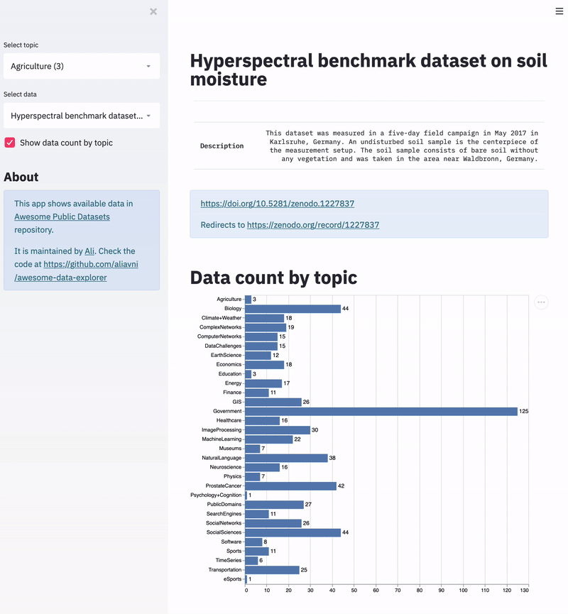

# Awesome Data Explorer

This app explores data in the [Awesome Public Datasets](https://github.com/awesomedata/awesome-public-datasets) repository.



# How to run

```
pip install -r requirements.txt
streamlit run app.py
```
